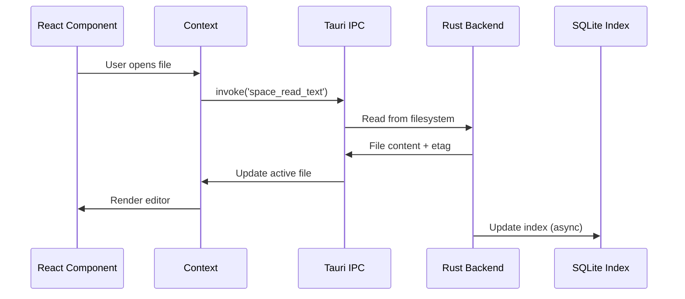
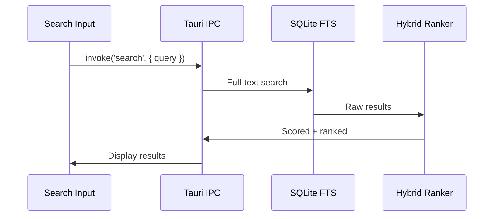

## Overview

Glyph is an offline-first desktop note-taking app built with a hybrid architecture:

- **Frontend**: React 19 + TypeScript + Vite + Tailwind 4
- **Backend**: Tauri 2 + Rust
- **Editor**: TipTap (Markdown)
- **AI**: Rig-backed multi-provider chat
- **UI**: shadcn/ui + Radix UI + Motion
- **Storage**: SQLite index + filesystem

## Application Structure

### Frontend (`src/`)

The frontend is a single-page React application with a context-based state management architecture.

<CodeGroup>
```typescript Entry Point
// src/main.tsx → App.tsx
<AppProviders>
  <AppShell />
</AppProviders>
```

```typescript Context Providers
// All state managed via React Context
- SpaceContext      // Space path & lifecycle
- FileTreeContext   // Files, tags, active file
- ViewContext       // Active view document
- UIContext         // Sidebar, search, preview state
- EditorContext     // TipTap editor instance
```
</CodeGroup>

### Backend (`src-tauri/src/`)

The Rust backend handles all filesystem operations, indexing, and AI integration.

<CodeGroup>
```rust Core Modules
lib.rs / main.rs      → Tauri setup, command registration
space/                → Space lifecycle (open/close/create)
space_fs/             → Filesystem operations
notes/                → Note CRUD, frontmatter parsing
index/                → SQLite FTS + tag indexing
ai_rig/               → Multi-provider AI runtime
ai_codex/             → Codex OAuth integration
links/                → Link preview fetching
database/             → Database view queries
```

```rust Safety Modules
paths.rs              → join_under() prevents traversal
io_atomic.rs          → Crash-safe atomic writes
net.rs                → SSRF prevention
glyph_paths.rs        → .glyph/ directory helpers
```
</CodeGroup>

## IPC Layer

Communication between frontend and backend uses **typed Tauri commands**.

<Steps>
  <Step title="Define Rust command">
    Implement command in `src-tauri/src/` module
    
    ```rust src-tauri/src/space/commands.rs
    #[tauri::command]
    pub fn space_open(path: String, state: State<SpaceState>) -> Result<SpaceInfo, String> {
      // Implementation
    }
    ```
  </Step>
  
  <Step title="Register in lib.rs">
    Add to Tauri builder's invoke handler
    
    ```rust src-tauri/src/lib.rs
    .invoke_handler(tauri::generate_handler![
      space_open,
      space_close,
      // ...
    ])
    ```
  </Step>
  
  <Step title="Add TypeScript types">
    Define in `TauriCommands` interface
    
    ```typescript src/lib/tauri.ts
    interface TauriCommands {
      space_open: CommandDef<{ path: string }, SpaceInfo>;
      // ...
    }
    ```
  </Step>
  
  <Step title="Invoke from frontend">
    Always use typed `invoke()` wrapper
    
    ```typescript
    import { invoke } from '@/lib/tauri';
    
    const spaceInfo = await invoke('space_open', { path: '/path/to/space' });
    ```
  </Step>
</Steps>

## Data Flow

### File Operations



### Search Flow



## State Management

### React Context Architecture

Glyph uses **no global state library** (no Redux/Zustand). All state is managed via React Context with the following hierarchy:

<CodeGroup>
```typescript SpaceContext
// Root-level: Space lifecycle
interface SpaceContextValue {
  spacePath: string | null;
  spaceSchemaVersion: number | null;
  onOpenSpace: () => Promise<void>;
  onCreateSpace: () => Promise<void>;
  closeSpace: () => Promise<void>;
}
```

```typescript FileTreeContext
// File browser state
interface FileTreeContextValue {
  rootEntries: FsEntry[];
  childrenByDir: Record<string, FsEntry[]>;
  expandedDirs: Set<string>;
  activeFilePath: string | null;
  tags: TagCount[];
}
```

```typescript EditorContext
// TipTap editor instance
interface EditorContextValue {
  editor: Editor | null;
  isEditing: boolean;
  saveState: 'saved' | 'saving' | 'unsaved';
}
```
</CodeGroup>

## File System Layout

Each space is a directory containing:

```
my-space/
├── notes/                # Markdown files with YAML frontmatter
│   └── example.md
├── assets/               # Content-addressed files (SHA256)
│   └── abc123...def.png
├── cache/                # Link previews, thumbnails
│   ├── links/
│   └── images/
├── .glyph/               # App metadata (not in space root)
│   ├── index.db          # SQLite FTS + tags
│   ├── ai_history.db     # Chat history
│   └── profiles.json     # AI provider configs
└── space.json            # Schema version
```

<Note>
The `.glyph/` folder stores derived data and can be safely deleted. It will be regenerated on next space open.
</Note>

## Build & Bundle

### Development

- `pnpm dev` - Vite dev server (frontend only)
- `pnpm tauri dev` - Full Tauri app with hot reload

### Production

- `pnpm build` - TypeScript check + Vite build
- `pnpm tauri build` - Create native app bundle
  - **macOS**: `.dmg` + `.app`
  - **Windows**: `.msi` + `.exe`
  - **Linux**: `.deb` + `.AppImage`

## Security Architecture

### Path Traversal Prevention

All space-relative paths are validated using `paths::join_under()`:

```rust src-tauri/src/paths.rs
pub fn join_under(base: &Path, rel: &str) -> Result<PathBuf, String> {
  // Rejects ".." components to prevent traversal attacks
}
```

### SSRF Prevention

User-supplied URLs (link previews) are checked before fetching:

```rust src-tauri/src/net.rs
pub fn check_user_url(url: &str, allow_private: bool) -> Result<(), String> {
  // Blocks private IPs unless explicitly allowed
}
```

### Atomic Writes

All file writes use crash-safe atomic operations:

```rust src-tauri/src/io_atomic.rs
pub fn write_atomic(path: &Path, contents: &[u8]) -> io::Result<()> {
  // Write to temp → sync → rename → sync parent dir
}
```

## Migration Policy

<Warning>
Glyph uses a **hard cutover migration approach**. When the space schema changes, old versions cannot open new spaces. Never implement backward compatibility.
</Warning>

Version is stored in `space.json`:

```json
{
  "version": 1
}
```
