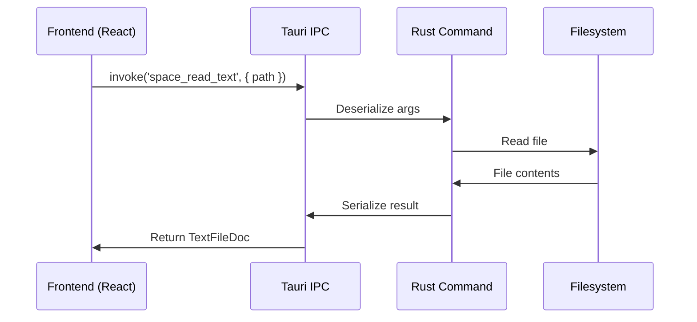

## Overview

Tauri commands are the IPC (inter-process communication) layer between the React frontend and Rust backend. All commands are:

- **Typed** on both sides (Rust + TypeScript)
- **Async** by default
- **Serialized** via JSON (serde)

## Command Flow



## Defining Commands

### Step 1: Implement Rust Command

```rust src-tauri/src/space_fs/read_write/text.rs
use tauri::State;
use crate::space::SpaceState;

#[derive(serde::Serialize)]
pub struct TextFileDoc {
    pub rel_path: String,
    pub text: String,
    pub etag: String,
    pub mtime_ms: u64,
}

#[tauri::command]
pub fn space_read_text(
    path: String,
    state: State<SpaceState>,
) -> Result<TextFileDoc, String> {
    let current = state.current.lock().unwrap();
    let space = current.as_ref().ok_or("No space open")?;
    
    let abs_path = paths::join_under(&space.root, &path)
        .map_err(|e| format!("Invalid path: {}", e))?;
    
    let text = fs::read_to_string(&abs_path)
        .map_err(|e| format!("Failed to read: {}", e))?;
    
    let metadata = fs::metadata(&abs_path)?;
    let mtime_ms = metadata.modified()?
        .duration_since(UNIX_EPOCH)
        .unwrap()
        .as_millis() as u64;
    
    let etag = format!("{}-{}", mtime_ms, metadata.len());
    
    Ok(TextFileDoc {
        rel_path: path,
        text,
        etag,
        mtime_ms,
    })
}
```

### Step 2: Register in lib.rs

```rust src-tauri/src/lib.rs
.invoke_handler(tauri::generate_handler![
    space_read_text,
    space_write_text,
    space_list_dir,
    // ... other commands
])
```

### Step 3: Add TypeScript Types

```typescript src/lib/tauri.ts
export interface TextFileDoc {
  rel_path: string;
  text: string;
  etag: string;
  mtime_ms: number;
}

interface TauriCommands {
  space_read_text: CommandDef<{ path: string }, TextFileDoc>;
}
```

### Step 4: Invoke from Frontend

```typescript
import { invoke } from '@/lib/tauri';

const doc = await invoke('space_read_text', {
  path: 'notes/example.md'
});

console.log(doc.text); // File contents
console.log(doc.etag); // ETag for caching
```

## Command Categories

### Space Lifecycle

<ParamField path="space_create" type="{ path: string } → SpaceInfo">
  Creates a new space at the given path
  
  ```typescript
  const info = await invoke('space_create', {
    path: '/Users/me/my-space'
  });
  // Returns: { root: '/Users/me/my-space', schema_version: 1 }
  ```
</ParamField>

<ParamField path="space_open" type="{ path: string } → SpaceInfo">
  Opens an existing space
  
  ```typescript
  const info = await invoke('space_open', {
    path: '/Users/me/my-space'
  });
  ```
</ParamField>

<ParamField path="space_get_current" type="void → string | null">
  Returns current space path or null
  
  ```typescript
  const path = await invoke('space_get_current');
  // Returns: '/Users/me/my-space' or null
  ```
</ParamField>

<ParamField path="space_close" type="void → void">
  Closes the current space
  
  ```typescript
  await invoke('space_close');
  ```
</ParamField>

### File System Operations

<ParamField path="space_list_dir" type="{ dir?: string | null } → FsEntry[]">
  Lists files and directories
  
  ```typescript
  const entries = await invoke('space_list_dir', {
    dir: 'notes/projects' // Optional, defaults to root
  });
  // Returns: [{ name: 'file.md', rel_path: 'notes/projects/file.md', kind: 'file', is_markdown: true }]
  ```
</ParamField>

<ParamField path="space_read_text" type="{ path: string } → TextFileDoc">
  Reads a text file with metadata
  
  ```typescript
  const doc = await invoke('space_read_text', {
    path: 'notes/example.md'
  });
  // Returns: { rel_path, text, etag, mtime_ms }
  ```
</ParamField>

<ParamField path="space_write_text" type="{ path: string, text: string, base_mtime_ms?: number } → TextFileWriteResult">
  Writes a text file atomically
  
  ```typescript
  const result = await invoke('space_write_text', {
    path: 'notes/example.md',
    text: '# Hello World',
    base_mtime_ms: doc.mtime_ms // Optional: detect conflicts
  });
  // Returns: { etag: '...', mtime_ms: 1234567890 }
  ```
</ParamField>

<ParamField path="space_create_dir" type="{ path: string } → void">
  Creates a directory
  
  ```typescript
  await invoke('space_create_dir', {
    path: 'notes/new-folder'
  });
  ```
</ParamField>

<ParamField path="space_rename_path" type="{ from_path: string, to_path: string } → void">
  Renames/moves a file or directory
  
  ```typescript
  await invoke('space_rename_path', {
    from_path: 'notes/old.md',
    to_path: 'notes/new.md'
  });
  ```
</ParamField>

<ParamField path="space_delete_path" type="{ path: string, recursive?: boolean } → void">
  Deletes a file or directory
  
  ```typescript
  await invoke('space_delete_path', {
    path: 'notes/old-folder',
    recursive: true
  });
  ```
</ParamField>

### Search & Index

<ParamField path="index_rebuild" type="void → IndexRebuildResult">
  Rebuilds the SQLite full-text search index
  
  ```typescript
  const result = await invoke('index_rebuild');
  // Returns: { indexed: 1234 }
  ```
</ParamField>

<ParamField path="search" type="{ query: string } → SearchResult[]">
  Full-text search across all notes
  
  ```typescript
  const results = await invoke('search', {
    query: 'machine learning'
  });
  // Returns: [{ id: 'notes/ml.md', title: 'ML Notes', snippet: '...', score: 0.95 }]
  ```
</ParamField>

<ParamField path="search_advanced" type="{ request: SearchAdvancedRequest } → SearchResult[]">
  Advanced search with filters
  
  ```typescript
  const results = await invoke('search_advanced', {
    request: {
      query: 'AI',
      tags: ['research', 'paper'],
      title_only: false,
      limit: 50
    }
  });
  ```
</ParamField>

<ParamField path="tags_list" type="{ limit?: number } → TagCount[]">
  Lists all tags with usage counts
  
  ```typescript
  const tags = await invoke('tags_list', { limit: 100 });
  // Returns: [{ tag: 'research', count: 42 }, { tag: 'project', count: 18 }]
  ```
</ParamField>

<ParamField path="backlinks" type="{ note_id: string } → BacklinkItem[]">
  Finds notes linking to a given note
  
  ```typescript
  const links = await invoke('backlinks', {
    note_id: 'notes/example.md'
  });
  // Returns: [{ id: 'notes/other.md', title: 'Other Note', updated: '2024-03-15T10:30:00Z' }]
  ```
</ParamField>

### AI Commands

<ParamField path="ai_chat_start" type="{ request: AiChatStartRequest } → AiChatStartResult">
  Starts an AI chat conversation
  
  ```typescript
  const result = await invoke('ai_chat_start', {
    request: {
      profile_id: 'openai-gpt4',
      messages: [
        { role: 'user', content: 'Explain quantum computing' }
      ],
      mode: 'chat',
      context: '# Research Notes\n...',
      audit: true
    }
  });
  // Returns: { job_id: 'abc123' }
  ```
</ParamField>

<ParamField path="ai_profiles_list" type="void → AiProfile[]">
  Lists configured AI provider profiles
  
  ```typescript
  const profiles = await invoke('ai_profiles_list');
  // Returns: [{ id: 'openai', name: 'OpenAI GPT-4', provider: 'openai', model: 'gpt-4', ... }]
  ```
</ParamField>

<ParamField path="ai_models_list" type="{ profile_id: string } → AiModel[]">
  Lists available models for a provider
  
  ```typescript
  const models = await invoke('ai_models_list', {
    profile_id: 'openai'
  });
  // Returns: [{ id: 'gpt-4', name: 'GPT-4', context_length: 8192, ... }]
  ```
</ParamField>

### Tasks

<ParamField path="tasks_query" type="{ bucket: TaskBucket, today: string, limit?: number, folders?: string[] } → TaskItem[]">
  Queries tasks by bucket (inbox, today, upcoming)
  
  ```typescript
  const tasks = await invoke('tasks_query', {
    bucket: 'today',
    today: '2024-03-15',
    limit: 100,
    folders: ['notes/projects']
  });
  // Returns: [{ task_id: '...', note_title: 'Project X', raw_text: '- [ ] Task', ... }]
  ```
</ParamField>

<ParamField path="task_set_checked" type="{ task_id: string, checked: boolean } → void">
  Toggles task completion
  
  ```typescript
  await invoke('task_set_checked', {
    task_id: 'task-abc123',
    checked: true
  });
  ```
</ParamField>

## Error Handling

### Rust Side

Always return `Result<T, String>`:

```rust
#[tauri::command]
pub fn risky_operation(path: String) -> Result<String, String> {
    if path.is_empty() {
        return Err("Path cannot be empty".to_string());
    }
    
    let contents = fs::read_to_string(&path)
        .map_err(|e| format!("Failed to read {}: {}", path, e))?;
    
    Ok(contents)
}
```

### Frontend Side

Use try/catch with `TauriInvokeError`:

```typescript
import { invoke, TauriInvokeError } from '@/lib/tauri';

try {
  const result = await invoke('risky_operation', { path: '' });
} catch (err) {
  if (err instanceof TauriInvokeError) {
    console.error('Command failed:', err.message);
    console.error('Raw error:', err.raw);
  }
}
```

## State Management

### Tauri State

Global state accessible to all commands:

```rust src-tauri/src/lib.rs
use tauri::Manager;

pub fn run() {
  tauri::Builder::default()
    .manage(SpaceState {
      current: Mutex::new(None),
    })
    .invoke_handler(tauri::generate_handler![...])
    .run(tauri::generate_context!())
    .expect("error while running tauri application");
}
```

Access in commands:

```rust
#[tauri::command]
fn my_command(state: State<SpaceState>) -> Result<String, String> {
  let current = state.current.lock().unwrap();
  let space = current.as_ref().ok_or("No space open")?;
  Ok(space.root.display().to_string())
}
```

## Type Safety

### Enforcing Type Consistency

The `TauriCommands` interface ensures TypeScript types match Rust:

```typescript src/lib/tauri.ts
type CommandDef<Args, Result> = { args: Args; result: Result };

interface TauriCommands {
  space_read_text: CommandDef<{ path: string }, TextFileDoc>;
  //                         ^──────────────^───────────^
  //                         Args match Rust    Result matches Rust
}
```

The `invoke()` helper enforces these types:

```typescript
export async function invoke<K extends keyof TauriCommands>(
  command: K,
  ...args: ArgsTuple<K>
): Promise<TauriCommands[K]['result']> {
  // Implementation
}
```

TypeScript will error if you:
- Pass wrong argument types
- Forget required arguments
- Expect wrong return type

## Performance Tips

### Batch Operations

Instead of N individual calls:

```typescript Bad
for (const path of paths) {
  const doc = await invoke('space_read_text', { path });
  // Process doc...
}
```

Use batch command:

```typescript Good
const docs = await invoke('space_read_texts_batch', { paths });
// Process all docs...
```

### Streaming Large Data

For large results, use events instead of return values:

```rust
use tauri::Emitter;

#[tauri::command]
pub fn large_operation(app: tauri::AppHandle) -> Result<(), String> {
  for chunk in get_large_data() {
    app.emit("data-chunk", &chunk)?;
  }
  Ok(())
}
```

```typescript
import { listen } from '@tauri-apps/api/event';

const unlisten = await listen<string>('data-chunk', (event) => {
  console.log('Received chunk:', event.payload);
});

await invoke('large_operation');
unlisten();
```

## Next Steps

<CardGroup cols={2}>
  <Card title="Indexing" icon="database" href="/development/backend/indexing">
    Learn about SQLite indexing
  </Card>
  
  <Card title="Storage" icon="hard-drive" href="/development/backend/storage">
    Content-addressed file storage
  </Card>
</CardGroup>
